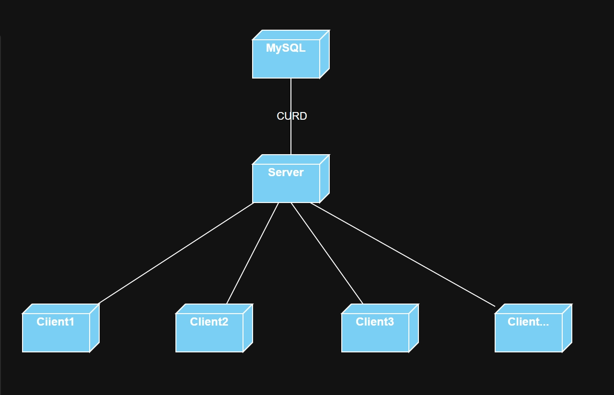
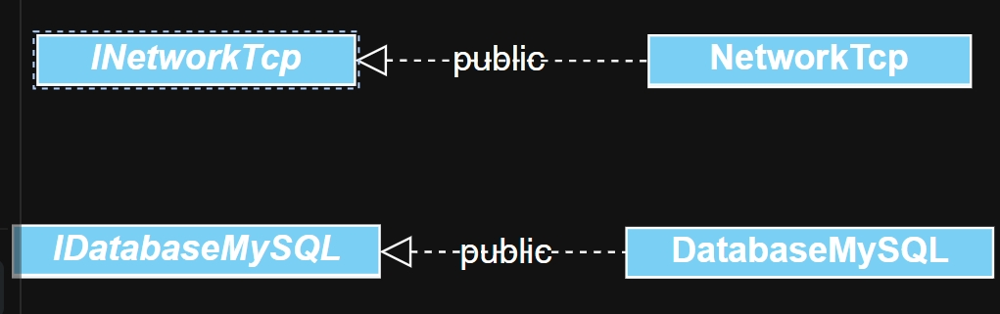
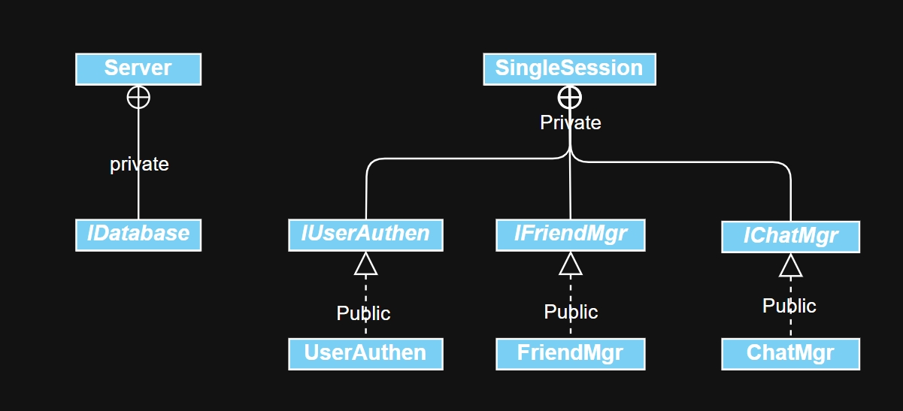
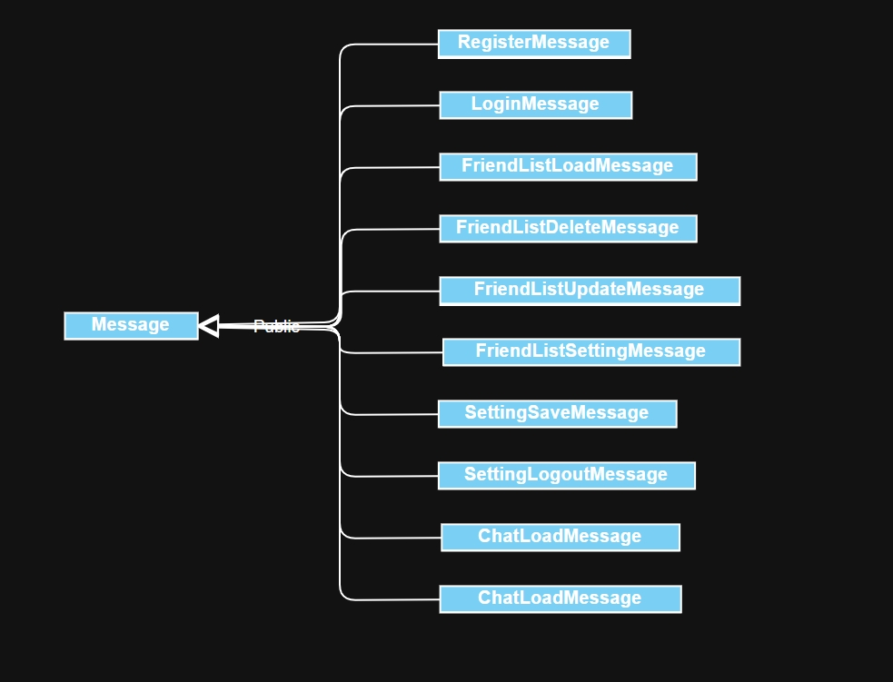
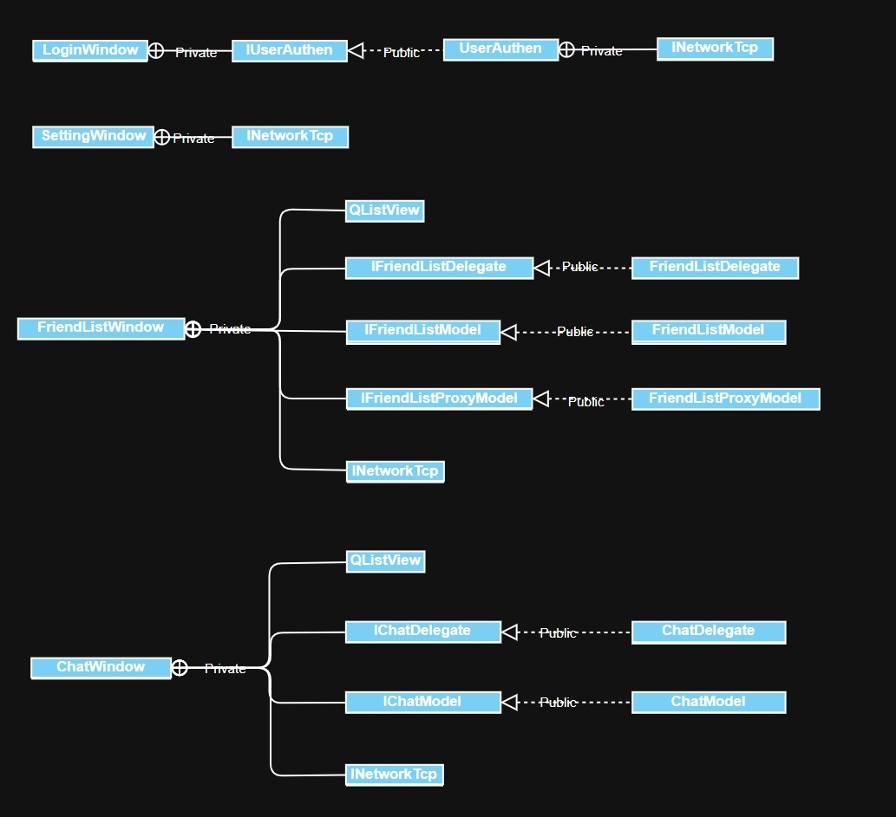
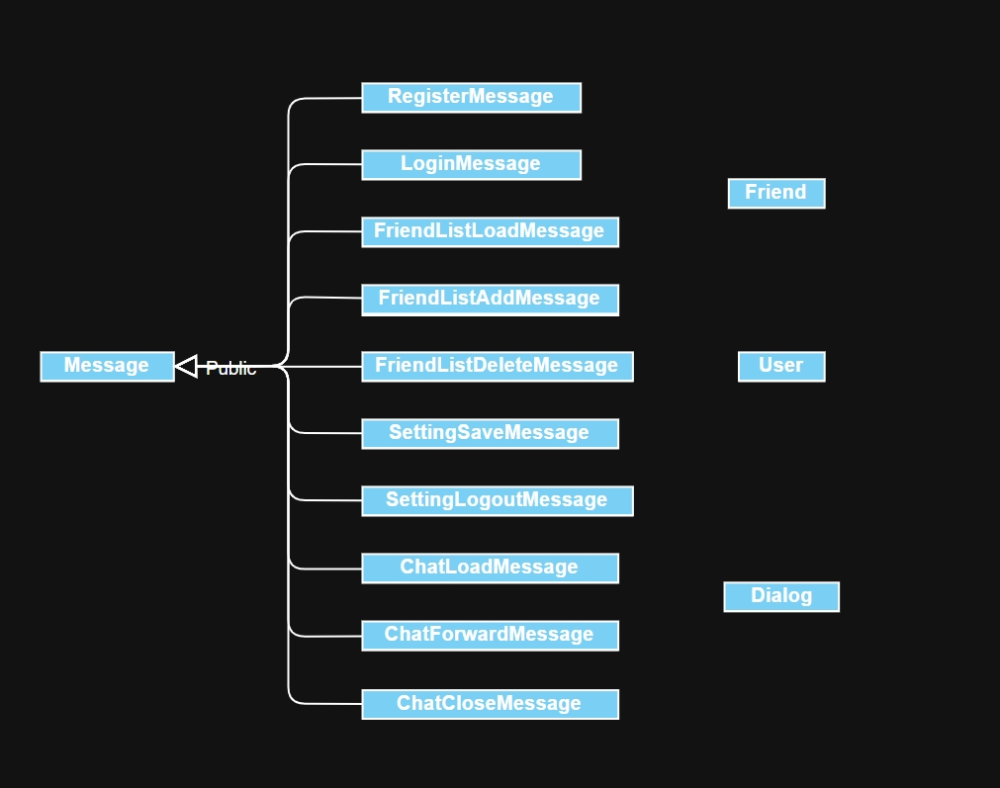

# 类QQ微信简易聊天软件

## 开发环境

1. Qt 6.6.3
2. Window11 家庭版
3. Mysql 8.0

## 程序架构C-S-S



## 设计理念

1. 单一职责原则
2. 面向接口编程/模块化
3. 面向对象编程
4. 视图模型（View-Model）架构
5. Qt信号与槽
6. Qt父对象机制
7. 单例模式
8. RAII
9. Json
10. 事件驱动

## 设计假设

1. 服务器在有客户端连接时不会中断
2. 服务器与数据库的连接总是正常的
3. 服务器处理的信息较少

## 面向接口设计

1. 服务端和客户端共分别有10个实现类（包含两个Enum类文件和一个基础数据类）和16个实现类（包含一个Enum类文件，三个基础数据类），整体上可以分为窗口类、实体辅助类、底层操作类和业务逻辑类，下面将分为服务器和客户端两个整体使用UML类图进行简要介绍
2. 服务端
   1. 底层操作类
        
      1. 类关系如上
      2. 此大类共有四个类，其中实现类NetworkTcp由接口类INetworkTcp派生，INetworkTcp通过纯虚函数定义了发送网络信息的接口，并且通过Qt的信号与槽机制发送信号来通知Server对象网络连接状态的变化，NetworkTcp类则具体实现了网络信息接受、解析、发送与建立断开连接的处理；实现类DatabaseMySQL类由接口类IDatabaseMySQL派生，IDatabaseMySQL通过纯虚函数定义了对mysql数据增删查改的操作接口，而DatabaseMySQL则提供了具体实现和数据库的连接和断开连接。
   2. 业务逻辑类
        
      1. 类关系如上
      2. 此大类共有9个类，其中IUserAuthen、IFriendMgr、IChatMgr、IDatabase分别定义了服务器对用户验证、好友关系处理、聊天处理和数据库处理的接口，UserAuthen、FriendMgr、ChatMgr是对接口的具体实现类；Server、SingleSession作为更高一层的抽象用于处理服务器中的用户管理、消息分发与用户会话具体操作消息的分流。
   3. 实体辅助类
        
      1. 类关系如上
      2. 此大类共有11个类，Message是所有消息类的公有继承操作，提供了getJsonObject()公有成员方法来获取不同消息的QJsonObject对象，并在10个不同消息的Message派生类中的构造函数实现对不同消息QJsonObject对象的初始化赋值，并最终作为网络信息发送。
3. 客户端
   1. 底层操作类
        
      1. 类关系如上
      2. 此大类一共有两个类，其中实现类NetworkTcp由接口类INetworkTcp派生，INetworkTcp通过纯虚函数定义了连接服务器、断开服务器连接、发送信息和查看socket状态的接口，并定义了断开连接和4种消息的信号，分别对应自生do_disconnected()槽函数和4种窗口中的槽函数处理对应信息；NetworkTcp类具体实现了INetworkTcp中的接口，并定义了两个槽函数来处理断开连接和初步解析信息并分发的功能
   2. 窗口类
        
      1. 类关系如上
      2. 此大类一共有15个类，使用了Qt的视图模型(View-Model)机制，其中IUserAuthen、IFriendListDelegate、IFriendListModel、IFriendListProxyModel、IChatDelegate、IChatModel六个类为抽象接口类，其分别定义了客户端用户认证、好友列表委托、好友列表源模型、好友列表代理模型、聊天窗口委托、聊天窗口模型的接口；UserAuthen、FriendListDelegate、FriendListModel、FriendListProxyModel、ChatDelegate、ChatModel则是对应接口的具体实现；而窗口类LoginWindow、SettingWindow、FriendListWindow、ChatWindow则实现了更高一层的抽象，将对应接口作为数据成员来实现显示、事务处理功能的集合，作为整体意义上的窗口对象运行。
   3. 实体辅助类
        
      1. 类关系如上
      2. 此大类一共有14个类，Message及其子类的设计原理和目的与服务器端中的Message类一致，客户端的实体辅助类相比服务端多了Friend、User和Dialog三个类，其中Friend和Dialog实现了对好友列表中的好友和聊天窗口中消息的抽象，将所需的数据作为一个整体，而User类使用单例模式，用于存储当前客户端登录用户的信息，可以用于在客户端程序中实时使用。

## 数据库表设计

1. 使用MySQL8.0版本
2. Qt中使用MySQL数据库需要添加相应的数据库驱动

```text
mysql> describe user_info;
+------------------+--------------+------+-----+---------+-------+
| Field            | Type         | Null | Key | Default | Extra |
+------------------+--------------+------+-----+---------+-------+
| client_id        | varchar(255) | NO   | PRI | NULL    |       |
| client_password  | varchar(255) | NO   |     | NULL    |       |
| client_nickname  | varchar(255) | YES  |     | NULL    |       |
| client_email     | varchar(255) | YES  |     | NULL    |       |
| client_signature | varchar(255) | YES  |     | NULL    |       |
| is_online        | tinyint(1)   | NO   |     | 0       |       |
+------------------+--------------+------+-----+---------+-------+

mysql> describe friend_list;
+---------------+--------------+------+-----+---------+-------+
| Field         | Type         | Null | Key | Default | Extra |
+---------------+--------------+------+-----+---------+-------+
| client_id     | varchar(255) | NO   | PRI | NULL    |       |
| friend_id     | varchar(255) | NO   | PRI | NULL    |       |
| last_msg_time | varchar(255) | YES  |     | NULL    |       |
| unread_msg    | int          | YES  |     | 0       |       |
| is_open       | tinyint(1)   | YES  |     | 0       |       |
+---------------+--------------+------+-----+---------+-------+

mysql> describe messages;
+-------------+--------------+------+-----+---------+----------------+
| Field       | Type         | Null | Key | Default | Extra          |
+-------------+--------------+------+-----+---------+----------------+
| message_id  | int          | NO   | PRI | NULL    | auto_increment |
| sender_id   | varchar(255) | NO   | MUL | NULL    |                |
| receiver_id | varchar(255) | NO   | MUL | NULL    |                |
| content     | text         | NO   |     | NULL    |                |
| time        | varchar(255) | NO   |     | NULL    |                |
+-------------+--------------+------+-----+---------+----------------+
```
